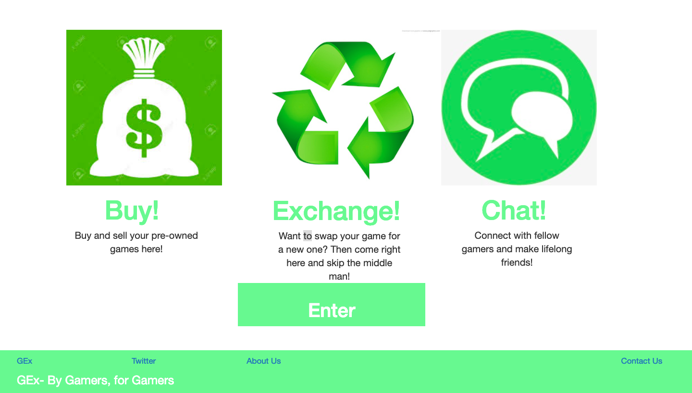
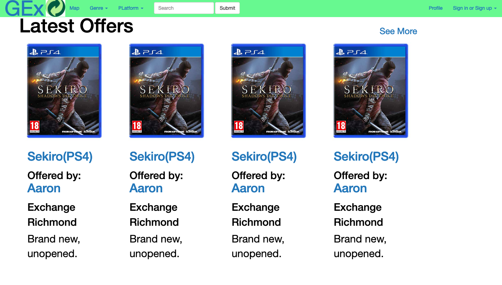
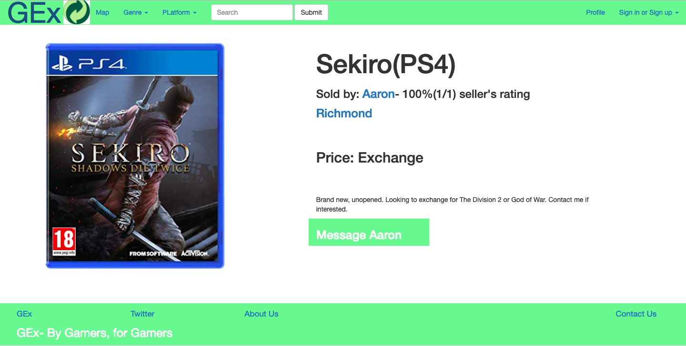

# Sparta Site Project- GEx

## __Task__
Create the layout for a website of our own choosing using Bootstrap v3.4.1. This site must include:

* At least 3 pages
* A Navbar and footer
* Responsiveness to different screen resolutions

## __Result__

The concept used was of a website that allowed users to sell or exhcange pre-owned games with one another. I created three pages of this website:

* Welcome page

* Home page

* Product page

The Navbar and footer are fully functional, and the can take users to the links that exist. I was also successful in optimizing the pages for different screen resolutions.

## **Instructions**
Clone this git repo and open the .html files locally in your browser.
